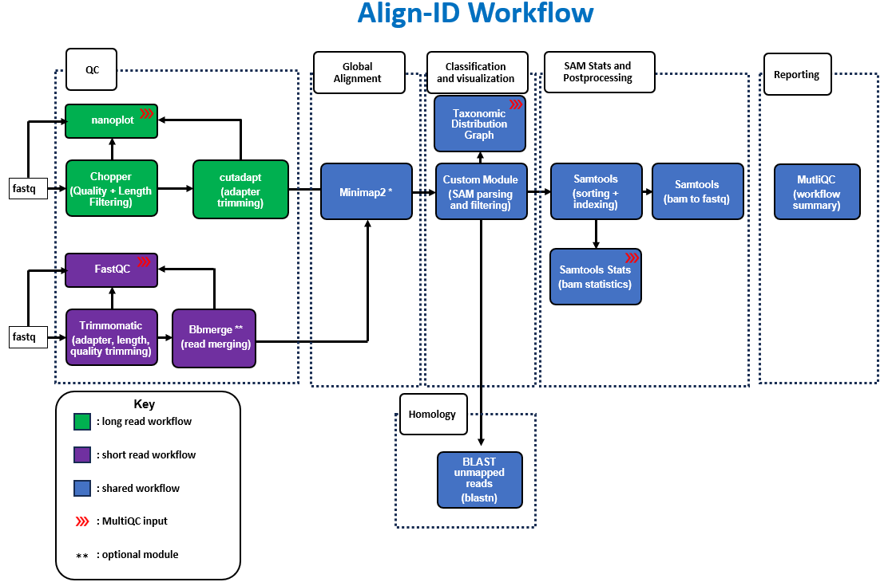
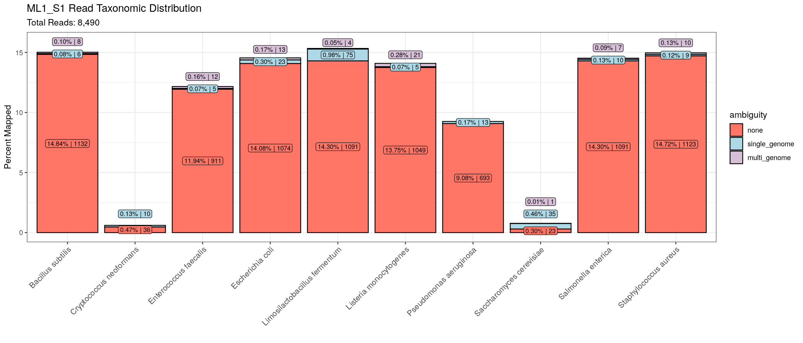

## Align-ID Workflow Diagram


## Summary

**Align-ID** is a bioinformatics workflow designed to generate taxonomic profiles from environmental samples sequenced by Oxford Nanopore and Illumia instruments using a competative alignment approach. This workflow houses two separate analysis pipelines for long read and short read data sets:

**Long Read ID**
1. _OPTIONAL_: Subsampling ([`BBMap`](https://github.com/BioInfoTools/BBMap))

2. Long read QC: 
     - Read Statistics/Summary ([`Nanoplot`](https://github.com/wdecoster/NanoPlot))
     - _OPTIONAL_: Adapter trimming ([`Porechop`](https://github.com/rrwick/Porechop))
     - Quality and Length Filtering ([`Chopper`](https://github.com/wdecoster/chopper))

3. Read Alignment ([`minimap2`](https://github.com/lh3/minimap2))

4. Read Alignment-based Classification (custom modules plus [`samtools`](https://www.htslib.org/doc/samtools.html))

     - _OPTIONAL_: alignment filtering by taxonomic ID (custom module)
     - _OPTIONAL_: alignment filtering by mapping quality (custom module)

5. Read Taxonomic Distribution Graph (custom module)

6. Alignment Statistics and Post-processing ([`samtools`](https://www.htslib.org/doc/samtools.html))

7. Workflow Summary ([`MultiQC`](https://github.com/MultiQC/MultiQC))


**Short Read ID**
1. _OPTIONAL_: Subsampling ([`BBMap`](https://github.com/BioInfoTools/BBMap))

2. Short read QC:     
     - Read QC ([`FastQC`](https://www.bioinformatics.babraham.ac.uk/projects/fastqc/))
     - Adapter Trimming, Quality Filtering, and Length Filtering ([`trimmomatic`](http://www.usadellab.org/cms/?page=trimmomatic) or [`fastp`](https://github.com/OpenGene/fastp))
     - _OPTIONAL_: Read Merging ([`BBMap`](https://github.com/BioInfoTools/BBMap))

3. Read Alignment ([`minimap2`](https://github.com/lh3/minimap2))

4. Read Alignment-based Classification (custom modules plus [`samtools`](https://www.htslib.org/doc/samtools.html))

     - _OPTIONAL_: alignment filtering by taxonomic ID (custom module)
     - _OPTIONAL_: alignment filtering by mapping quality (custom module)

5. Read Taxonomic Distribution Graph (custom module)

6. Alignment Statistics and Post-processing ([`samtools`](https://www.htslib.org/doc/samtools.html))

7. Workflow Summary ([`MultiQC`](https://github.com/MultiQC/MultiQC))

## Environment

This workflow uses assets and dependencies native to the CDC's SciComp environment. If you do not have access to the SciComp environment, you can request an account [`here`](https://info.biotech.cdc.gov/info/helpdesk-ticket/?category=Account%20Requests). You will also need access to the EMEL Group Working Area found here `/scicomp/groups-pure/OID/NCEZID/DFWED/WDPB/EMEL/`. If you do not have access you may request read-only access [`here`](https://info.biotech.cdc.gov/info/helpdesk-ticket/?category=GWA%20/%20Lab%20Instruments%20/%20Home%20Directory)

**Long Read Setup**
In order to reduce GPU node usage (only two are available), lond reads should be basecalled prior to execution. There is a bash script located here: `bin\dorado-convert.sh` that is designed to take pod5 files and perform basecalling, demultiplexing, adapter trimming, and  fastq conversion (NOTE: this bash script is not embedded in the actual Align ID workflow and should be ran as a stand alone process outside of this project directory)


## Setup

First, prepare a samplesheet with your input fastq data that looks as follows:

**Long Read Samplesheet**

`assets\long-read\samplesheet.csv`:

```csv
sample,fastq_long
SAMPLE_1,/scicomp/groups-pure/OID/NCEZID/DFWED/WDPB/EMEL/long-reads/sample1-long-read-ont.fastq.gz
SAMPLE_2,/scicomp/groups-pure/OID/NCEZID/DFWED/WDPB/EMEL/long-reads/sample2-long-read-ont.fastq.gz
```

The top row is the header row ("sample,fastq_long") and should never be altered. Each row below the header, represents a fastq file with a unique identifier in the "sample" column (SAMPLE_1 and SAMPLE_2 in the example above). Each fastq file needs to be gzipped/compressed to prevent validation errors from occuring at the initialization of the pipeline

There is an example samplesheet located under the assets folder (`assets/long-read/samplesheet.csv`) that you can view and edit yourself. **NOTE** If you use this samplesheet, please make a back up copy of it as it will be overwritten each time you pull an updated version of this repository. 

**Short Read Samplesheet**

Paired Reads `assets\short-read\samplesheet_paired.csv`:

```csv
sample,fastq_1,fastq_2
SAMPLE_1,/data/reads/sample1-R1.fastq.gz,data/reads/sample1-R2.fastq.gz
SAMPLE_2,/data/reads/sample2-R1.fastq.gz,data/reads/sample2-R2.fastq.gz
```

Single End or Merged Reads `assets\short-read\samplesheet_merged.csv`:

```csv
sample,fastq_1,fastq_2
SAMPLE_1,/data/reads/sample1-R1.fastq.gz,
SAMPLE_2,/data/reads/sample2-R1.fastq.gz,
```

Notice how the short read samplesheets have 3 header columns `sample,fastq_1,fastq_2`. Just as with the long reads, never change these headers. The fastq_1 and fastq_2 columns are where you specify the forward and reverse paired reads respectively. If you are using single end reads or merged reads then you will only input one fastq file but DO NOT DELETE THE SECOND COMMA in the sample entry row (referenced the samplesheet_merged example above)

**Config File Setup**

Next we'll want to make a copy of the `long-read.conf` and `short-read.conf` configuration files located in the `conf` directory and rename them to include your username. For example:

`cp conf/short-read.conf <target-dir>/rtq0-short-read.conf`

To avoid overwrite issues when pulling updated versions of this repository, you should store these config files outside of the project directory.

Now open the config file with your text editor of choice and make the appropriate adjustments to your parameters. Of note, you'll want to change the `input` and `outdir` parameters according to the input samplesheet you setup and an output directory that contains your user ID and is unique to your dataset

**Reference Genome and Index**

Align-ID needs a minimap index of the entire set of reference fastas you intend to map your reads to. To generate this index you'll want to first, concatenate all reference genome fastas into a single file:

```bash
cat ref_genome_1.fasta ref_genome_2.fasta > all_ref_genomes.fasta
```

Insert the file path to your combined fasta into this minimap2 command (minimap2 singularity container included in command):

Long Read Format:
```bash
singularity exec --bind /scicomp /scicomp/groups-pure/OID/NCEZID/DFWED/WDPB/EMEL/singularity/minimap2/minimap2%3A2.28--he4a0461_1 minimap2 -x map-ont -d all_ref_genomes.mmi all_ref_genomes.fasta
```

Short Read Format:
```bash
singularity exec --bind /scicomp /scicomp/groups-pure/OID/NCEZID/DFWED/WDPB/EMEL/singularity/minimap2/minimap2%3A2.28--he4a0461_1 minimap2 -x sr -d all_ref_genomes.mmi all_ref_genomes.fasta
```

Note that the `-d` flag with a `.mmi` file extension represents the output index file path.

Once you've created your minimap2 index, go into your configuration file(s) and update the `minimap2_index` parameter with the file path to your new minimap2 index

**Taxonomy Map**

This pipeline uses a sequence ID to taxonomic ID mapping file to assign taxonomy. When a read maps to a reference sequence, the algorithm uses this taxonomy file to look up the tax ID associated with that reference sequence. The tax ID map is formatted with the `sequence ID` in the first column and the `tax ID` in the second column:

```tsv
AP025345.1	5098
AP028243.1	3040995
CP099429.1	215465
CP119914.1	1381934
```

This is just a snippet of the mapping file. The full mapping file assigned to the `seqid2taxid_map` variable in the configuration file(s) contains all RefSeq sequences and their respective tax IDs (a small batch of ZYMO reference sequences are included as well). This workflow has been optimized for species level classification, so any strain level alignments will be assigned to their corresponding parent species taxonomy.

**Custom Reference Genomes and Taxonomy**

If you are using reference genomes that are not in RefSeq you will need to manually add the sequence/accession IDs to the taxonomy map. There is a helper script `bin/add_fasta_to_seq_map.sh` that can assist you in adding a reference fasta of one species into the taxonomy map. The script expects a path to an existing or new seqid2taxid mapping file, one reference fasta comprised of contigs from a single species, and the taxonomic ID of that species:

```bash
bash ./bin/add_fasta_to_seq_map.sh '/path/to/seqid2taxid.map' '/path/to/ref_fasta' species_tax_ID
```

If you are planning on mapping your sample to multiple custom reference genomes from different species then you will need to run this script once per reference fasta. 
NOTE: This step needs to be performed on individual fasta files. Do not run this script on a concatentated fasta unless each individual fasta originated from the same species


## Usage

Once the samplesheet has been formatted and the configuration files have been modified, we can run the workflow using one of the 2 methods listed below.

**Method 1: Cluster Submission**:

The `qsub` method allows you to submit the workflow as a job to SciComp's cluster computing nodes for enhanced processing speeds and workload parallelization. This is a good "fire and forget" method for new users who aren't as familiar with SciComp's compute environment

Long Read Format:
```bash
bash ./run_qsub.sh 'long' 'path/to/long-read-config'
```

Short Read Format:
```bash
bash ./run_qsub.sh 'short' 'path/to/long-read-config'
```


**Method 2: Local Execution**:

If you are familiar with nextflow and SciComp's computing environment, you can invoke the `nextflow` command straight from the terminal. **NOTE: if you are using this method you will need to load up a nextflow environment via `module load` or `conda`**
 
Long Read Format:
```bash
nextflow run main.nf -c 'path/to/long-read-config' -profile singularity,local,long
```

Short Read Format:
```bash
nextflow run main.nf -c 'path/to/short-read-config' -profile singularity,local,short
```


## Output

All results will be sent to the `./results` directory unless otherwise stated using the `--outdir` parameter. The outputs of various tools can be found under their respective names (i.e. the FastQC results can be found under `./results/fastqc`). The unique outputs from this workflow can be found under the `alignment_classification` and `alignment_classification_graph` directories. These outputs will summarize the taxonomic distribution of the sample in both text-based and graphical format.

Text-based Format:

```tsv
species	num_reads	percent_reads	ambiguity
Staphylococcus aureus	1123	14.718218	none
Enterococcus faecalis	911	11.939712	none
Bacillus subtilis	1132	14.836173	none
Limosilactobacillus fermentum	1091	14.29882	none
Listeria monocytogenes	1049	13.748362	none
Pseudomonas aeruginosa	693	9.082569	none
Salmonella enterica	1091	14.29882	none
Saccharomyces cerevisiae	23	0.301442	none
Cryptococcus neoformans	36	0.471822	none
Escherichia coli	1074	14.076016	none
Staphylococcus aureus	9	0.117955	single_genome
Enterococcus faecalis	5	0.065531	single_genome
Bacillus subtilis	6	0.078637	single_genome
Limosilactobacillus fermentum	75	0.982962	single_genome
Listeria monocytogenes	5	0.065531	single_genome
Pseudomonas aeruginosa	13	0.17038	single_genome
Salmonella enterica	10	0.131062	single_genome
Saccharomyces cerevisiae	35	0.458716	single_genome
Cryptococcus neoformans	10	0.131062	single_genome
Escherichia coli	23	0.301442	single_genome
Staphylococcus aureus	10	0.131062	multi_genome
Enterococcus faecalis	12	0.157274	multi_genome
Bacillus subtilis	8	0.104849	multi_genome
Limosilactobacillus fermentum	4	0.052425	multi_genome
Listeria monocytogenes	21	0.275229	multi_genome
Salmonella enterica	7	0.091743	multi_genome
Saccharomyces cerevisiae	1	0.013106	multi_genome
Escherichia coli	13	0.17038	multi_genome
```

Graphical Format:


In the bar plot above, each species is subdivided into 3 different ambiguity groups. The red portion represents unambiguous read mappings, blue corresponds to ambiguously aligned reads within a single genome, and purple indicates ambiguous alignments across multiple genomes. All data labels contain the percentage of reads (out of all reads) and number of reads associated with a particular species and ambiguity group The bar plot can depict up to 20 different species. All classifications made after the 20th species will be grouped into a 'other' species.

For additional details on how ambiguity is determine along with examples, please read [docs/ambiguity_examples.md](docs/ambiguity_examples.md)


## Parameters

Parameters for the long read and short read analysis pipelines are located in `./conf/long-read.conf` and `./conf/short-read.conf` respectively. You can manually change these parameters via a text editor or you can pass in the individual parameters via the command line (see the Usage section above for command line parameter formatting and syntax). See below for all possible input parameters:


**Shared Parameters**:
| Parameter | Data Type | Default Value |
|:---------:|:---------:|:-------------:|
| `--metagenomic_sample` |  boolean | true |
| `--memory_saver` | boolean | false |
| `--skip_subsample` | boolean | true |
| `--skip_trimming` | boolean | false |
| `--skip_alignment_based_filtering` | boolean | false |
| `--skip_bbmap_dedup` | boolean | false |
| `--skip_assembly` | boolean | true |
| `--skip_binning` | boolean | true |
| `--skip_blast` | boolean | true |
| **BBmap Parameters**|            |            |
| `--num_subsamples` | integer | 1000 |
| **Minimap2 Parameters** |            |            |
| `--minimap2_meta` | string | "all-genomes" |
| `--split_prefix` | boolean | false |
| **Alignment Classification Parameters** |            |            |
| `--seqid2taxid_map` | string | "/scicomp/groups-pure/OID/NCEZID/DFWED/WDPB/EMEL/Projects/Long_Read_Analysis_RUSHER/data/taxonomy/seqid2taxid_no-strain.map" |
| `--filter_alignment_by_id` | boolean | false |
| `--my_tax_ids` | string | "./assets/tax_ids_acanth-verm-naegleria.txt" |
| `--include_children` | boolean | false |
| `--ncbi_taxonomy_nodes` | string | "/scicomp/groups-pure/OID/NCEZID/DFWED/WDPB/EMEL/Projects/Long_Read_Analysis_RUSHER/data/taxonomy/nodes.dmp" |
| `--ncbi_taxonomy_names` | string | "/scicomp/groups-pure/OID/NCEZID/DFWED/WDPB/EMEL/Projects/Long_Read_Analysis_RUSHER/data/taxonomy/names.dmp" |
| `--local_nodes_db` | string | "/scicomp/groups-pure/OID/NCEZID/DFWED/WDPB/EMEL/Reference_Databases/taxonomy/nodes_sqlite3.db" |
| `--mapping_quality` | integer | 0 |
| `--non_standard_reference` | boolean | false |
| `--use_tmux_multiprocessing` | boolean | true |
| **BLAST Parameters** |            |            |
| `--use_blast_standard` | boolean | false |
| `--blast_standard_db` | string | "/scicomp/reference/ncbi-blast-databases/nt" |
| `--blast_db` | string | "/scicomp/groups-pure/OID/NCEZID/DFWED/WDPB/EMEL/Projects/Long_Read_Analysis_RUSHER/data/blast/arch-bact-fung-hum-amoeba_refseq/arch-bact-fung-hum-amoeba_refseq" |
| `--blast_evalue` | string | "1e-10" |
| `--blast_perc_identity` | string | "90" |
| `--blast_target_seqs` | string | "5" |


**Long Read Specific Parameters**:
| Parameter | Data Type | Default Value |
|:---------:|:---------:|:-------------:|
| `--skip_cutadapt` | boolean | true |
| **CutAdapt Parameters** |            |            |
| `--cutadapt_adapter_fasta` | string | "./assets/long-read/adapters/ATL-gene-adapters_cutadapt.fasta" |
| **Chopper Parameters** |            |            |
| `--chopper_q` | integer | 20 |
| `--chopper_min_len` | integer | 1000 |
| `--chopper_max_len` | integer | 2147483647 |
| **Minimap2 Parameters** |            |            |
| `--minimap2_index` | string | '/scicomp/groups-pure/OID/NCEZID/DFWED/WDPB/EMEL/Projects/Long_Read_Analysis_RUSHER/data/minimap2/index/long-read/ATL_gene.mmi' |
| `--minimap2_mismatch_penalty` | integer | 4 |


**Short Read Specific Parameters**:
| Parameter | Data Type | Default Value |
|:---------:|:---------:|:-------------:|
| `--skip_merging` | boolean | true |
| **Trimming Parameters** |            |            |
| `--trim_tool` | string | "trimmomatic" |
| `--adapt_ref` | string | "./assets/short-read/sequencing-adapters.fasta" |
| **Trimmomatic Parameters** |            |            |
| `--trimmomatic_params` | string | "ILLUMINACLIP:./assets/short-read/sequencing-adapters.fasta:2:30:10 SLIDINGWINDOW:4:20 MINLEN:50" |
| **FASTP Parameters** |            |            |
| `--fastp_params` | string | "" |
| `--adapter_auto_detect` | boolean | false |
| **Minimap2 Parameters** |            |            |
| `--minimap2_index` | string | '/scicomp/groups-pure/OID/NCEZID/DFWED/WDPB/EMEL/Projects/Long_Read_Analysis_RUSHER/data/minimap2/index/short-read/ZYMO.mmi' |
| `--minimap2_mismatch_penalty` | integer | 8 |


## Credits

Align-ID was originally written by Sam Rusher (rtq0@cdc.gov).

## Citations

This pipeline uses code and infrastructure developed and maintained by the [nf-core](https://nf-co.re) community, reused here under the [MIT license](https://github.com/nf-core/tools/blob/master/LICENSE).

> **The nf-core framework for community-curated bioinformatics pipelines.**
>
> Philip Ewels, Alexander Peltzer, Sven Fillinger, Harshil Patel, Johannes Alneberg, Andreas Wilm, Maxime Ulysse Garcia, Paolo Di Tommaso & Sven Nahnsen.
>
> _Nat Biotechnol._ 2020 Feb 13. doi: [10.1038/s41587-020-0439-x](https://dx.doi.org/10.1038/s41587-020-0439-x).

## CDC Metadata

Org: Division of Foodborne Waterborne and Environmental Diseases, WDPB
Contact Email: ncezid_shareit@cdc.gov
Exemption: exemptByAgencySystem
Exemption Justification: Contains server names and file paths to advanced molecular detection scripts, algorithms, workflows and datasets used by the waterborne disease prevention branch for surveillance and outbreak investigations
